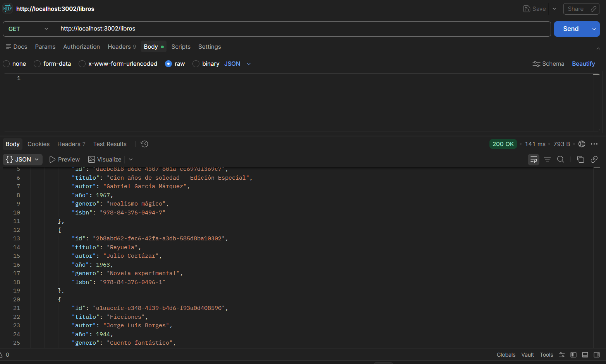
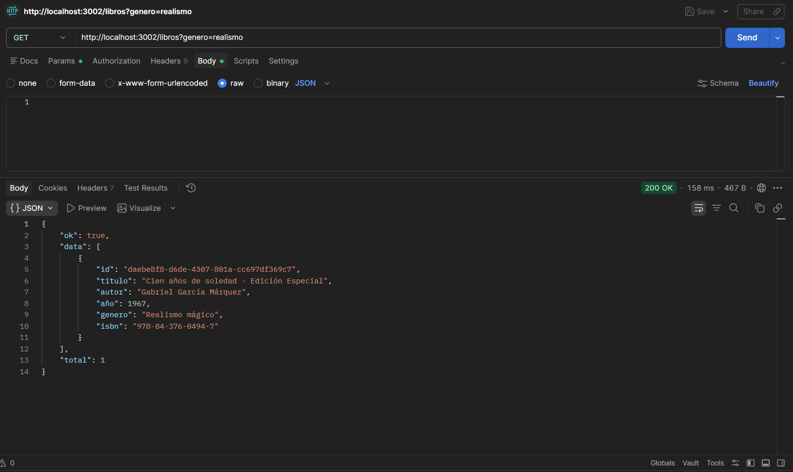
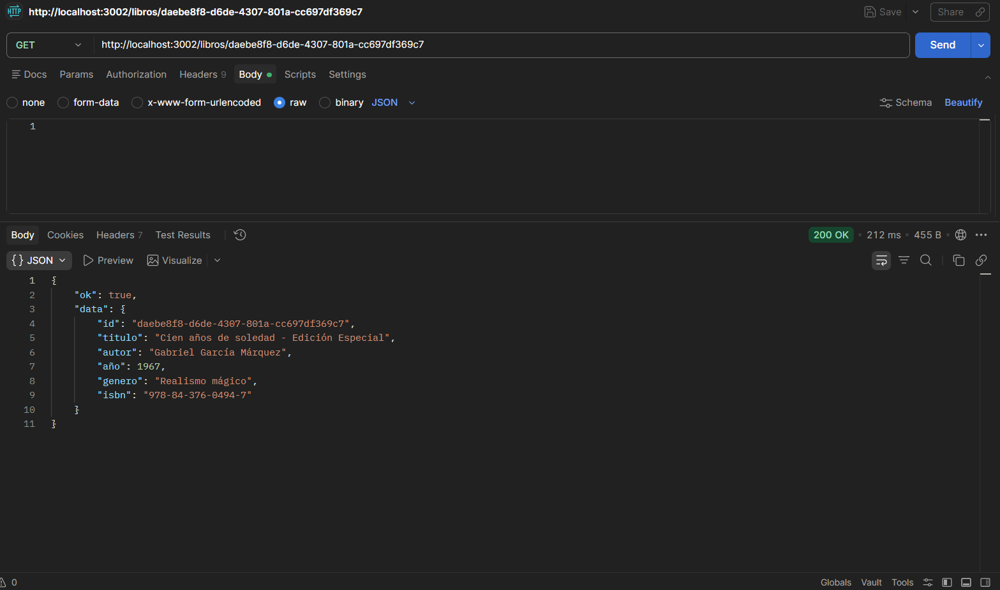
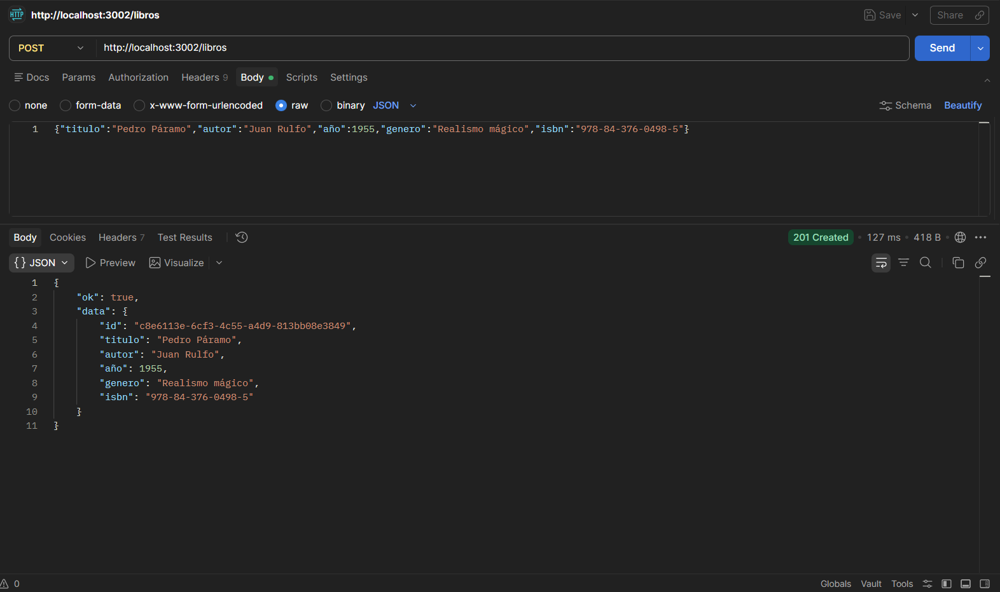

# Pruebas de la API - Postman

**Nombre:** Sebastián Lemus  
**Carnet:** 241155  


### 1. GET /libros - Listar todos los libros



**URL:** `http://localhost:3002/libros`  
**Respuesta esperada:** Status 200, array de libros

---

### 2. GET /libros?genero=realismo - Filtrar por género



**URL:** `http://localhost:3002/libros?genero=realismo`  
**Respuesta esperada:** Status 200, solo libros del género "Realismo mágico"

---

### 3. GET /libros/:id - Obtener libro por ID



**URL:** `http://localhost:3002/libros/daebe8f8-d6de-4307-801a-cc697df369c7`  
**Respuesta esperada:** Status 200, objeto del libro

---

### 4. POST /libros - Crear un nuevo libro



**URL:** `http://localhost:3002/libros`  
**Método:** POST  
**Body (raw JSON):**
```json
{
    "titulo": "Pedro Páramo",
    "autor": "Juan Rulfo",
    "año": 1955,
    "genero": "Realismo mágico",
    "isbn": "978-84-376-0498-5"
}
