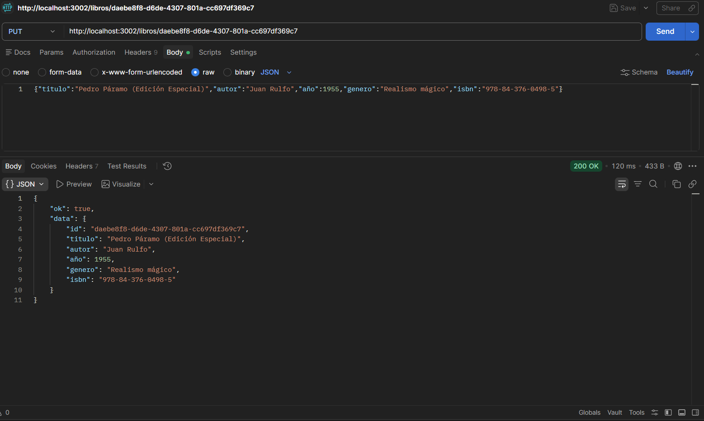
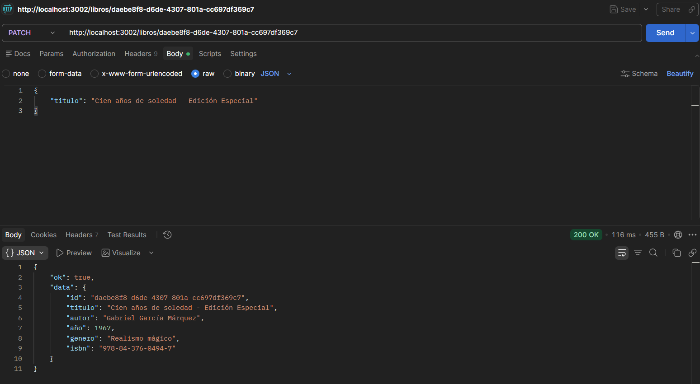
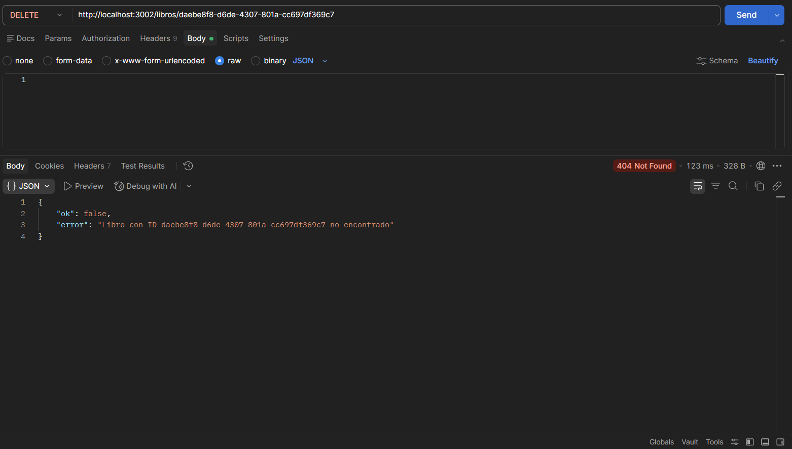

# Pruebas de la API - Postman

**Nombre:** Sebastián Lemus  
**Carnet:** 241155  

### 1. GET /libros - Listar todos los libros

### 2. GET /libros?genero=realismo - Filtrar por género

### 3. GET /libros/:id - Obtener libro por ID

### 4. POST /libros - Crear un nuevo libro

### 5. PUT /libros/:id - Actualizar libro completo

### 6. PATCH /libros/:id - Actualizar parcialmente

### 7. DELETE /libros/:id - Eliminar un libro
